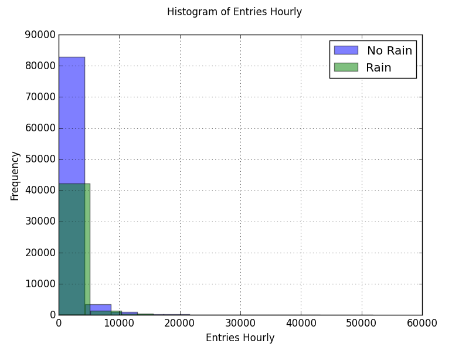
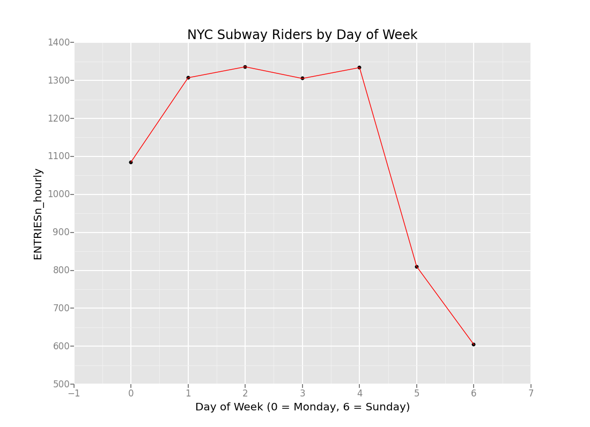

# Analyzing the NYC Subway Dataset
Max Edwards
Data Analyst Nanodegree Project#3, 10-30-15

## Section 1. Statistical Test

### 1.1 Which statistical test did you use to analyze the NYC subway data? Did you use a one-tail or a two-tail P value? What is the null hypothesis? What is your p-critical value?

I used a two tailed Mann-Whitney U test to perform an analysis on NYC subway data. Intuitively, one would think that rain would increase subway riders but we have no evidence to make this hypothesis. Therefore, I used a two-tailed test with the null hypothesis that the two populations are the same and an alternative hypothesis that the populations are not the same. This test was run using a 95% confidence or p-critical of 0.05.

### 1.2 Why is this statistical test applicable to the dataset? In particular, consider the assumptions that the test is making about the distribution of ridership in the two samples

The histogram (see Section 3) of the hourly entries when it was raining and not raining was non-normal. Therefore, Welch’s t-test is not appropriate. I decided to use a non-parametric test (Mann-Whitney U test) because it does not assume the data was drawn from any underlying probability distribution.

### 1.3 What results did you get from this statistical test? These should include the following numerical values: p-values, as well as the means for each of the two samples under test.

I ran the following code to obtain the results from performing a Mann-Whitney U test.

`turnstile_weather = 'turnstile_data_master_with_weather.csv'`

`df = pandas.read_csv(turnstile_weather)`

`with_rain_mean = np.mean(df['ENTRIESn_hourly'][df['rain'] == 1])`

`without_rain_mean = np.mean(df['ENTRIESn_hourly'][df['rain'] == 0])`

`x = df['ENTRIESn_hourly'][df['rain'] == 1]`

`y = df['ENTRIESn_hourly'][df['rain'] == 0]`

`U, p = scipy.stats.mannwhitneyu(x,y)`

`U = U*2 # for two tail`

`p = p*2 # for two tail`

`print with_rain_mean`

`print without_rain_mean`

`print U`

`print p`

Output of code I wrote is below. Note: I tried to update my scipy package but that did not seem to change my results. Previous grader suggested I should be receiving a p-value of ~0.25:

`Mean ridership when it is raining is and 1,105.44637675`

`Mean ridership when it is not raining is and 1,090.27878015`

`U stat is and 3,848,818,334.0`

`p-value is and 0.038619268827585131`

### 1.4 What is the significance and interpretation of these results?

when it is raining (1,105.45 hourly entries) is approximately 15 hourly entries greater compared to when it is not raining (1,090.28 hourly entries). This could be interpreted as a very small difference at face value.
However, The p-value of [0.0386] is less than the p-critical value of 0.05. Therefore, the null hypothesis is rejected and we can say there is a significant difference between subway ridership when it is raining and when it is not raining. Additionally, the U statistic of 3,848,818,334 is very close to the maximum of 3,874,404,088 (the product of the two sample sizes). It would need to be closer to half of the product (1,937,202,044) to accept the null hypothesis.

## Section 2. Linear Regression

### 2.1 What approach did you use to compute the coefficients theta and produce prediction for ENTRIESn_hourly in your regression model:

Using the SciKit Learn package in Python, I used a SGD Regession model to converge on the parameters that minimized the cost function and create the prediction model for hourly entries (‘ENTRIESn_hourly’).

### 2.2 What features (input variables) did you use in your model? Did you use any dummy variables as part of your features?

The features I used were (‘precipi’, ‘Hour’, ‘meantempi’) along with the dummy variable ‘UNITn’ (categorical).

### 2.3 Why did you select these features in your model?

I used the default provided features except for ‘rain’. I decided ‘rain’ is essentially a subset of ‘precipi’ so they aren’t independent of each other and using both in the model does not really change the models predictive ability (in terms of R-squared). My intuition is that all precipitation would increase subway ridership. We already found that rain increases subway ridership so I believe this intuition is valid (although not statistically proven).
I attempted to use several other features (‘fog’, ‘thunder’, etc) but these did not have a drastic effect on R-squared. I did add EXITSn_hourly and the R-squared jumped to about 0.55. However, realistically, this data would not be available to us for out of sampling predictions. It is possible that we could use the previous four hours of exits to predict the next four hours of entries. However I did not attempt this as it is assuming the model would be operating in real-time. Theoretically you could implement such a model but for the purposes of this project, it doesn’t make sense.

### 2.4 What are the parameters (also known as "coefficients" or "weights") of the non-dummy features in your linear regression model?

array([-28584707.9014013 , -46174147.5821939 , 12092403.73019567])
where; ‘precipi’ is index 0, ‘Hour’ in index 1, and ‘meantempi’ is index 2

### 2.5 What is your model’s R2 (coefficients of determination) value?

R_squared was: 0.4123

### 2.6 What does this R2 value mean for the goodness of fit for your regression model? Do you think this linear model to predict ridership is appropriate for this dataset, given this R2 value?

The R-squared value represents how much of the variation is explained by the model or more concretely the percentage of variation explained by the model. I think the model is appropriate for a quick estimate of subway ridership but I don’t think it’s the best model. It is likely that more advanced algorithms could develop a better prediction model (in terms of R-squared) but one would have to be careful to avoid over fitting the data when developing such a model.

## Section 3. Visualization

The histogram below displays the distributions for ENTRIESn_hourly when it raining and when it is not raining. Note that this does not indicate that there are more riders when it is not raining as this is pure frequencies. There were 87,847 observations when it was raining and 44,104 observations when it was not raining. I generated the plot using the following code:

`turnstile_weather = 'turnstile_data_master_with_weather.csv'`

`df = pandas.read_csv(turnstile_weather)`

`plt.figure()`

`df['ENTRIESn_hourly'][df['rain'] == 0].hist(alpha = 0.5, bins = 150) # histogram for hourly entries when it is raining`

`df['ENTRIESn_hourly'][df['rain'] == 1].hist(alpha = 0.5, bins = 150) # histogram for hourly entries when it is not raining`

`plt.axis([0, 6000, 0, 50000])`

`plt.suptitle('Histogram of Entries Hourly')`

`plt.xlabel('Entries Hourly')`

`plt.ylabel('Frequency')`

`plt.legend(['No Rain', 'Rain'])`

`print plt`

Using the code below, I generated the line chart showing entries by day of week (0=Monday and 6=Sunday):

`# data frame using turnstile weather_data. Formatting date column to use dayofweek method`
`turnstile_weather = 'turnstile_data_master_with_weather.csv'`
`df = pandas.read_csv(turnstile_weather)`
`df['DATEn_formatted'] = pandas.to_datetime(df['DATEn'], format='%Y-%m-%d')`
`df['dayofweek'] = df['DATEn_formatted'].apply(lambda x: x.dayofweek)`
`# group data using groupby function and aggregate method`
`grouped = df.groupby(['dayofweek'], as_index=False).aggregate(np.mean)`
`# create plot to show average entries by each day of week`
`plot = ggplot(aes('dayofweek', 'ENTRIESn_hourly'), grouped) + \`
`geom_point(color = 'black') +geom_line(color = 'red') + \`
`ggtitle("NYC Subway Riders by Day of Week") + \`
`xlab("Day of Week (0 = Monday, 6 = Sunday)") + ylab('Entries') + \`
`scale_y_continuous(breaks=range(0,1100,100))`

## Section 4. Conclusion

Based on the results of the Mann-Whitney U test, it was determined with 95% confidence that more people ride the NYC subway when it is raining compared to when it is not raining. Using the linear regression model, I set the features array for ‘precipi’ equal to zero and one. When set to zero, the mean prediction was 1089.51 hourly entries and when set to 1, the mean prediction was 1078.38 hourly entries. Since ‘rain’ is a subset of ‘precipi’, I believe this shows that more people ride the NYC subway when it is raining or in generally when it’s precipitating.

## Section 5. Reflection

The main issue I noticed from the start was that the entries and exits did not lineup (mean of 1095.35 entries versus mean of 886.89 exits). This is concerning from a data integrity standpoint as there is somewhat of a significant difference between the two variables. Also, the thunder variable is all zeros so it seems the column was added but the data was never actually recorded. I would dig further given these initial findings to determine if I would actually use this dataset in real world applications.
The SGD regression model was sufficient for the purposes of this class and being able to make a decent prediction of subway ridership. It is certainly not anywhere close to a model that could actually be used for a production type environment. By introducing a linear model, you are inherently introducing bias – meaning the model lacks the ability to account for a lot of the variation (hence the difficulty of raising the R-squared). Additionally, it is usually better to split up the available data into a training set, cross-validation set, and test set in order to create an environment where you can test the model out of sample. This would become more important when using the more complicated models.
The Mann-Whitney U test was used to understand if there was a significant difference between ridership when it’s raining versus not raining. By using this test, we are limiting ourselves in terms of what we can quantitatively say
about the actual difference between the two populations. We provide the mean and median but we don’t have any information regarding the variance.

## References

1. http://pandas.pydata.org/pandas-docs/stable/generated/pandas.DataFrame.html
2. http://scikit-learn.org/stable/modules/generated/sklearn.linear_model.SGDRegressor.html#sklearn.linear_model.SGDRegressor
3. https://en.wikipedia.org/wiki/Mann%E2%80%93Whitney_U_test
4. http://matplotlib.org/users/pyplot_tutorial.html